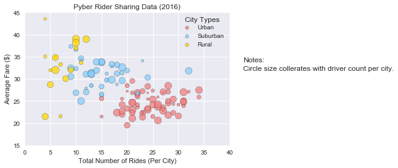
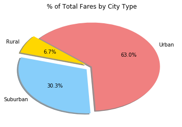
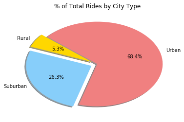
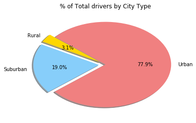

```python
# Observed trend 1 : 
#  Urban has more short distance rides than the rest. 
#  Urban area has more rides but its average fee is lower. Almost 1/3 of total rides happends in urban area.
# Observed trend 2 :
#  Urban has more drivers. B
#  Because the plot side is larger. 68% of total drivers come from urban area.
# Observed trend 3 :
#  Most of fares come from urban area but the distance of riders tend to longer.
#  Because 62% of total fares come from rural area but its average fare is higher.
```


```python
import pandas as pd
import matplotlib.pyplot as plt 
import seaborn as sns
```


```python
ridefile_path = 'data/ride_data.csv'
ride_df = pd.read_csv(ridefile_path)
ride_df.head()
```


<div>
<style>
    .dataframe thead tr:only-child th {
        text-align: right;
    }

    .dataframe thead th {
        text-align: left;
    }

    .dataframe tbody tr th {
        vertical-align: top;
    }
</style>
<table border="1" class="dataframe">
  <thead>
    <tr style="text-align: right;">
      <th></th>
      <th>city</th>
      <th>date</th>
      <th>fare</th>
      <th>ride_id</th>
    </tr>
  </thead>
  <tbody>
    <tr>
      <th>0</th>
      <td>Sarabury</td>
      <td>2016-01-16 13:49:27</td>
      <td>38.35</td>
      <td>5403689035038</td>
    </tr>
    <tr>
      <th>1</th>
      <td>South Roy</td>
      <td>2016-01-02 18:42:34</td>
      <td>17.49</td>
      <td>4036272335942</td>
    </tr>
    <tr>
      <th>2</th>
      <td>Wiseborough</td>
      <td>2016-01-21 17:35:29</td>
      <td>44.18</td>
      <td>3645042422587</td>
    </tr>
    <tr>
      <th>3</th>
      <td>Spencertown</td>
      <td>2016-07-31 14:53:22</td>
      <td>6.87</td>
      <td>2242596575892</td>
    </tr>
    <tr>
      <th>4</th>
      <td>Nguyenbury</td>
      <td>2016-07-09 04:42:44</td>
      <td>6.28</td>
      <td>1543057793673</td>
    </tr>
  </tbody>
</table>
</div>


```python
cityfile_path = 'data/city_data.csv'
city_df = pd.read_csv(cityfile_path)
city_df.head()
```


<div>
<style>
    .dataframe thead tr:only-child th {
        text-align: right;
    }

    .dataframe thead th {
        text-align: left;
    }

    .dataframe tbody tr th {
        vertical-align: top;
    }
</style>
<table border="1" class="dataframe">
  <thead>
    <tr style="text-align: right;">
      <th></th>
      <th>city</th>
      <th>driver_count</th>
      <th>type</th>
    </tr>
  </thead>
  <tbody>
    <tr>
      <th>0</th>
      <td>Kelseyland</td>
      <td>63</td>
      <td>Urban</td>
    </tr>
    <tr>
      <th>1</th>
      <td>Nguyenbury</td>
      <td>8</td>
      <td>Urban</td>
    </tr>
    <tr>
      <th>2</th>
      <td>East Douglas</td>
      <td>12</td>
      <td>Urban</td>
    </tr>
    <tr>
      <th>3</th>
      <td>West Dawnfurt</td>
      <td>34</td>
      <td>Urban</td>
    </tr>
    <tr>
      <th>4</th>
      <td>Rodriguezburgh</td>
      <td>52</td>
      <td>Urban</td>
    </tr>
  </tbody>
</table>
</div>


```python
pb_df = pd.merge(ride_df, city_df, how = 'outer', on = 'city')
pb_df.head()
```


<div>
<style>
    .dataframe thead tr:only-child th {
        text-align: right;
    }

    .dataframe thead th {
        text-align: left;
    }

    .dataframe tbody tr th {
        vertical-align: top;
    }
</style>
<table border="1" class="dataframe">
  <thead>
    <tr style="text-align: right;">
      <th></th>
      <th>city</th>
      <th>date</th>
      <th>fare</th>
      <th>ride_id</th>
      <th>driver_count</th>
      <th>type</th>
    </tr>
  </thead>
  <tbody>
    <tr>
      <th>0</th>
      <td>Sarabury</td>
      <td>2016-01-16 13:49:27</td>
      <td>38.35</td>
      <td>5403689035038</td>
      <td>46</td>
      <td>Urban</td>
    </tr>
    <tr>
      <th>1</th>
      <td>Sarabury</td>
      <td>2016-07-23 07:42:44</td>
      <td>21.76</td>
      <td>7546681945283</td>
      <td>46</td>
      <td>Urban</td>
    </tr>
    <tr>
      <th>2</th>
      <td>Sarabury</td>
      <td>2016-04-02 04:32:25</td>
      <td>38.03</td>
      <td>4932495851866</td>
      <td>46</td>
      <td>Urban</td>
    </tr>
    <tr>
      <th>3</th>
      <td>Sarabury</td>
      <td>2016-06-23 05:03:41</td>
      <td>26.82</td>
      <td>6711035373406</td>
      <td>46</td>
      <td>Urban</td>
    </tr>
    <tr>
      <th>4</th>
      <td>Sarabury</td>
      <td>2016-09-30 12:48:34</td>
      <td>30.30</td>
      <td>6388737278232</td>
      <td>46</td>
      <td>Urban</td>
    </tr>
  </tbody>
</table>
</div>


```python
ub_df = pb_df.loc[pb_df['type'] == 'Urban']
ub_df.head()
```


<div>
<style>
    .dataframe thead tr:only-child th {
        text-align: right;
    }

    .dataframe thead th {
        text-align: left;
    }

    .dataframe tbody tr th {
        vertical-align: top;
    }
</style>
<table border="1" class="dataframe">
  <thead>
    <tr style="text-align: right;">
      <th></th>
      <th>city</th>
      <th>date</th>
      <th>fare</th>
      <th>ride_id</th>
      <th>driver_count</th>
      <th>type</th>
    </tr>
  </thead>
  <tbody>
    <tr>
      <th>0</th>
      <td>Sarabury</td>
      <td>2016-01-16 13:49:27</td>
      <td>38.35</td>
      <td>5403689035038</td>
      <td>46</td>
      <td>Urban</td>
    </tr>
    <tr>
      <th>1</th>
      <td>Sarabury</td>
      <td>2016-07-23 07:42:44</td>
      <td>21.76</td>
      <td>7546681945283</td>
      <td>46</td>
      <td>Urban</td>
    </tr>
    <tr>
      <th>2</th>
      <td>Sarabury</td>
      <td>2016-04-02 04:32:25</td>
      <td>38.03</td>
      <td>4932495851866</td>
      <td>46</td>
      <td>Urban</td>
    </tr>
    <tr>
      <th>3</th>
      <td>Sarabury</td>
      <td>2016-06-23 05:03:41</td>
      <td>26.82</td>
      <td>6711035373406</td>
      <td>46</td>
      <td>Urban</td>
    </tr>
    <tr>
      <th>4</th>
      <td>Sarabury</td>
      <td>2016-09-30 12:48:34</td>
      <td>30.30</td>
      <td>6388737278232</td>
      <td>46</td>
      <td>Urban</td>
    </tr>
  </tbody>
</table>
</div>


```python
sub_df = pb_df.loc[pb_df['type'] == 'Suburban']
sub_df.head()
```


<div>
<style>
    .dataframe thead tr:only-child th {
        text-align: right;
    }

    .dataframe thead th {
        text-align: left;
    }

    .dataframe tbody tr th {
        vertical-align: top;
    }
</style>
<table border="1" class="dataframe">
  <thead>
    <tr style="text-align: right;">
      <th></th>
      <th>city</th>
      <th>date</th>
      <th>fare</th>
      <th>ride_id</th>
      <th>driver_count</th>
      <th>type</th>
    </tr>
  </thead>
  <tbody>
    <tr>
      <th>1625</th>
      <td>Port James</td>
      <td>2016-12-04 06:16:36</td>
      <td>15.77</td>
      <td>2259499336994</td>
      <td>15</td>
      <td>Suburban</td>
    </tr>
    <tr>
      <th>1626</th>
      <td>Port James</td>
      <td>2016-05-16 21:25:03</td>
      <td>26.26</td>
      <td>4051110168629</td>
      <td>15</td>
      <td>Suburban</td>
    </tr>
    <tr>
      <th>1627</th>
      <td>Port James</td>
      <td>2016-01-04 22:46:29</td>
      <td>20.25</td>
      <td>3994763896598</td>
      <td>15</td>
      <td>Suburban</td>
    </tr>
    <tr>
      <th>1628</th>
      <td>Port James</td>
      <td>2016-01-27 19:25:42</td>
      <td>21.86</td>
      <td>2433830274897</td>
      <td>15</td>
      <td>Suburban</td>
    </tr>
    <tr>
      <th>1629</th>
      <td>Port James</td>
      <td>2016-05-30 15:35:47</td>
      <td>38.05</td>
      <td>424462809740</td>
      <td>15</td>
      <td>Suburban</td>
    </tr>
  </tbody>
</table>
</div>


```python
ru_df = pb_df.loc[pb_df['type'] == 'Rural']
ru_df.head()
```


<div>
<style>
    .dataframe thead tr:only-child th {
        text-align: right;
    }

    .dataframe thead th {
        text-align: left;
    }

    .dataframe tbody tr th {
        vertical-align: top;
    }
</style>
<table border="1" class="dataframe">
  <thead>
    <tr style="text-align: right;">
      <th></th>
      <th>city</th>
      <th>date</th>
      <th>fare</th>
      <th>ride_id</th>
      <th>driver_count</th>
      <th>type</th>
    </tr>
  </thead>
  <tbody>
    <tr>
      <th>2250</th>
      <td>Horneland</td>
      <td>2016-07-19 10:07:33</td>
      <td>12.63</td>
      <td>8214498891817</td>
      <td>8</td>
      <td>Rural</td>
    </tr>
    <tr>
      <th>2251</th>
      <td>Horneland</td>
      <td>2016-03-22 21:22:20</td>
      <td>31.53</td>
      <td>1797785685674</td>
      <td>8</td>
      <td>Rural</td>
    </tr>
    <tr>
      <th>2252</th>
      <td>Horneland</td>
      <td>2016-01-26 09:38:17</td>
      <td>21.73</td>
      <td>5665544449606</td>
      <td>8</td>
      <td>Rural</td>
    </tr>
    <tr>
      <th>2253</th>
      <td>Horneland</td>
      <td>2016-03-25 02:05:42</td>
      <td>20.04</td>
      <td>5729327140644</td>
      <td>8</td>
      <td>Rural</td>
    </tr>
    <tr>
      <th>2254</th>
      <td>Kinghaven</td>
      <td>2016-05-18 23:28:12</td>
      <td>20.53</td>
      <td>6432117120069</td>
      <td>3</td>
      <td>Rural</td>
    </tr>
  </tbody>
</table>
</div>


```python
# Your objective is to build a Bubble Plot that showcases the relationship between four key variables:
# Average Fare ($) Per City
# Total Number of Rides Per City
# Total Number of Drivers Per City
# City Type (Urban, Suburban, Rural)
```


```python
# urban data
ub_count = ub_df.groupby('city').count()
ub_mean = ub_df.groupby('city').mean()

ub_avg_fare_list = list(ub_mean['fare'])
ub_ride_list = list(ub_count['ride_id'])
ub_driver_list = list(ub_mean['driver_count'])
ub_lar_driver_list = [x*2 for x in ub_driver_list]
```


```python
# suburban data
sub_count = sub_df.groupby('city').count()
sub_mean = sub_df.groupby('city').mean()

sub_avg_fare_list = list(sub_mean['fare'])
sub_ride_list = list(sub_count['ride_id'])
sub_driver_list = list(sub_mean['driver_count'])
sub_lar_driver_list = [x*2 for x in ub_driver_list]
```


```python
# rural data
ru_count = ru_df.groupby('city').count()
ru_mean = ru_df.groupby('city').mean()

ru_avg_fare_list = list(ru_mean['fare'])
ru_ride_list = list(ru_count['ride_id'])
ru_driver_list = list(ru_mean['driver_count'])
ru_lar_driver_list = [x*2 for x in ub_driver_list]
```


```python
colors = ['lightcoral', 'lightskyblue', 'Gold']
```


```python
urban = plt.scatter(ub_ride_list, ub_avg_fare_list, marker="o", facecolors=colors[0], edgecolors="black", s=ub_lar_driver_list, alpha=0.75)
suburban = plt.scatter(sub_ride_list, sub_avg_fare_list, marker="o", facecolors=colors[1], edgecolors="black", s=sub_lar_driver_list, alpha=0.75)
rural = plt.scatter(ru_ride_list, ru_avg_fare_list, marker="o", facecolors=colors[2], edgecolors="black", s=ru_lar_driver_list, alpha=0.75)
```


```python
plt.ylim(15, 45)
plt.xlim(0, 40)
plt.xlabel('Total Number of Rides (Per City)')
plt.ylabel('Average Fare ($)')
plt.title('Pyber Rider Sharing Data (2016)')
plt.figtext(0.95, 0.6, 'Notes:', rotation='horizontal')
plt.figtext(0.95, 0.55, 'Circle size collerates with driver count per city.', rotation='horizontal')
plt.figtext(0.73, 0.83, 'City Types', rotation='horizontal')
```


    Text(0.73,0.83,'City Types')


```python
lgnd = plt.legend((urban, suburban, rural),('Urban', 'Suburban', 'Rural'),loc='upper right',bbox_to_anchor=(1, 0.95))
for handle in lgnd.legendHandles:
    handle.set_sizes([30])
```


```python
#sns.set()
plt.show()
```





```python
# In addition, you will be expected to produce the following three pie charts:
# % of Total Fares by City Type
# % of Total Rides by City Type
# % of Total Drivers by City Type
```


```python
u_pb_df = pb_df.drop_duplicates(['city'], keep = 'last')
t_driver_df = u_pb_df.groupby('type').sum()
t_driver_df
```


<div>
<style>
    .dataframe thead tr:only-child th {
        text-align: right;
    }

    .dataframe thead th {
        text-align: left;
    }

    .dataframe tbody tr th {
        vertical-align: top;
    }
</style>
<table border="1" class="dataframe">
  <thead>
    <tr style="text-align: right;">
      <th></th>
      <th>fare</th>
      <th>ride_id</th>
      <th>driver_count</th>
    </tr>
    <tr>
      <th>type</th>
      <th></th>
      <th></th>
      <th></th>
    </tr>
  </thead>
  <tbody>
    <tr>
      <th>Rural</th>
      <td>632.39</td>
      <td>94410487104274</td>
      <td>104</td>
    </tr>
    <tr>
      <th>Suburban</th>
      <td>1214.61</td>
      <td>229842791708027</td>
      <td>635</td>
    </tr>
    <tr>
      <th>Urban</th>
      <td>1554.37</td>
      <td>309657203558548</td>
      <td>2607</td>
    </tr>
  </tbody>
</table>
</div>


```python
t_sum_df = pb_df.groupby('type').sum()
t_count_df = pb_df.groupby('type').count()

t_type_list = list(t_count_df.index.values)
t_fare_list = list(t_sum_df['fare'])
t_ride_list = list(t_count_df['ride_id'])
t_driver_list = list(t_driver_df['driver_count'])
```


```python
colors = ['Gold', 'lightskyblue', 'lightcoral']
explode = (0.1,0.1,0)
```


```python
plt.pie(t_fare_list, explode=explode, labels=t_type_list, colors=colors,
       autopct="%1.1f%%", shadow=True, startangle=140)
```


    ([<matplotlib.patches.Wedge at 0x5d62b30>,
      <matplotlib.patches.Wedge at 0x5d75150>,
      <matplotlib.patches.Wedge at 0x5d757d0>],
     [Text(-1.05986,0.562756,'Rural'),
      Text(-0.93658,-0.750212,'Suburban'),
      Text(0.983035,0.493602,'Urban')],
     [Text(-0.618252,0.328274,'6.7%'),
      Text(-0.546338,-0.437624,'30.3%'),
      Text(0.536201,0.269237,'63.0%')])


```python
#plt.axis("equal")
```


```python
plt.title('% of Total Fares by City Type')
plt.show()
```





```python
plt.pie(t_ride_list, explode=explode, labels=t_type_list, colors=colors,
       autopct="%1.1f%%", shadow=True, startangle=140)
```


    ([<matplotlib.patches.Wedge at 0x5dc53f0>,
      <matplotlib.patches.Wedge at 0x5dc5a50>,
      <matplotlib.patches.Wedge at 0x5dcd0f0>],
     [Text(-1.03368,0.609521,'Rural'),
      Text(-1.07564,-0.531982,'Suburban'),
      Text(1.05282,0.318709,'Urban')],
     [Text(-0.602977,0.355554,'5.3%'),
      Text(-0.627455,-0.310323,'26.3%'),
      Text(0.574264,0.173841,'68.4%')])


```python
plt.title('% of Total Rides by City Type')
plt.show()
```





```python
plt.pie(t_driver_list, explode=explode, labels=t_type_list, colors=colors,
       autopct="%1.1f%%", shadow=True, startangle=140)
```


    ([<matplotlib.patches.Wedge at 0x689fd90>,
      <matplotlib.patches.Wedge at 0x68ac410>,
      <matplotlib.patches.Wedge at 0x68aca90>],
     [Text(-0.990074,0.678051,'Rural'),
      Text(-1.19477,-0.111881,'Suburban'),
      Text(1.09999,-0.00470497,'Urban')],
     [Text(-0.577543,0.39553,'3.1%'),
      Text(-0.696951,-0.0652636,'19.0%'),
      Text(0.599995,-0.00256635,'77.9%')])


```python
plt.title('% of Total drivers by City Type')
plt.show()
```




