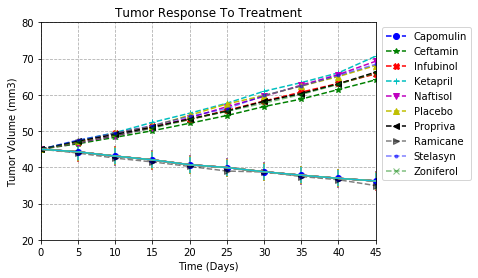
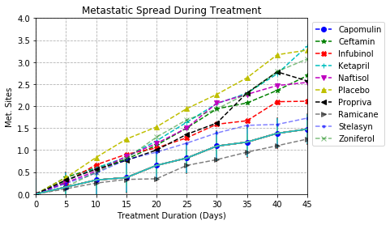

Observed trend 1 : 
Tumor Volume (mm3) increase for all drugs except Capomulin and Ramicane. They are the only two among all to decrease Tumor Volume (mm3).Thus Capomulin and Ramicane should be the most efficient drugs to control the Tumor Volume (mm3). 

Observed trend 2 :
For growth rate of Metastatic Sites of Capomulin and Ramicane are the lowest of all. Thus Capomulin and Ramicane are 
most efficient drugs to control Metastatic spread.

Observed trend 3 :
Mouse survial rate drecrese dramatically for all drugs except Capomulin and Ramicane. They should be the most efficient drugs to save mouses' life.


```python
import pandas as pd
import matplotlib.pyplot as plt 
import seaborn as sns
from scipy import stats
```


```python
filename1 = 'data/clinicaltrial_data.csv'
clinicaltrial_data = pd.read_csv(filename1)
clinicaltrial_data.head()
```


<div>
<style>
    .dataframe thead tr:only-child th {
        text-align: right;
    }

    .dataframe thead th {
        text-align: left;
    }

    .dataframe tbody tr th {
        vertical-align: top;
    }
</style>
<table border="1" class="dataframe">
  <thead>
    <tr style="text-align: right;">
      <th></th>
      <th>Mouse ID</th>
      <th>Timepoint</th>
      <th>Tumor Volume (mm3)</th>
      <th>Metastatic Sites</th>
    </tr>
  </thead>
  <tbody>
    <tr>
      <th>0</th>
      <td>b128</td>
      <td>0</td>
      <td>45.0</td>
      <td>0</td>
    </tr>
    <tr>
      <th>1</th>
      <td>f932</td>
      <td>0</td>
      <td>45.0</td>
      <td>0</td>
    </tr>
    <tr>
      <th>2</th>
      <td>g107</td>
      <td>0</td>
      <td>45.0</td>
      <td>0</td>
    </tr>
    <tr>
      <th>3</th>
      <td>a457</td>
      <td>0</td>
      <td>45.0</td>
      <td>0</td>
    </tr>
    <tr>
      <th>4</th>
      <td>c819</td>
      <td>0</td>
      <td>45.0</td>
      <td>0</td>
    </tr>
  </tbody>
</table>
</div>


```python
filename2 = 'data/mouse_drug_data.csv'
mouse_drug_data = pd.read_csv(filename2)
mouse_drug_data.head()
```


<div>
<style>
    .dataframe thead tr:only-child th {
        text-align: right;
    }

    .dataframe thead th {
        text-align: left;
    }

    .dataframe tbody tr th {
        vertical-align: top;
    }
</style>
<table border="1" class="dataframe">
  <thead>
    <tr style="text-align: right;">
      <th></th>
      <th>Mouse ID</th>
      <th>Drug</th>
    </tr>
  </thead>
  <tbody>
    <tr>
      <th>0</th>
      <td>f234</td>
      <td>Stelasyn</td>
    </tr>
    <tr>
      <th>1</th>
      <td>x402</td>
      <td>Stelasyn</td>
    </tr>
    <tr>
      <th>2</th>
      <td>a492</td>
      <td>Stelasyn</td>
    </tr>
    <tr>
      <th>3</th>
      <td>w540</td>
      <td>Stelasyn</td>
    </tr>
    <tr>
      <th>4</th>
      <td>v764</td>
      <td>Stelasyn</td>
    </tr>
  </tbody>
</table>
</div>


```python
pm_df = pd.merge(clinicaltrial_data, mouse_drug_data, how = 'outer', on = 'Mouse ID')
pm_df.head()
```


<div>
<style>
    .dataframe thead tr:only-child th {
        text-align: right;
    }

    .dataframe thead th {
        text-align: left;
    }

    .dataframe tbody tr th {
        vertical-align: top;
    }
</style>
<table border="1" class="dataframe">
  <thead>
    <tr style="text-align: right;">
      <th></th>
      <th>Mouse ID</th>
      <th>Timepoint</th>
      <th>Tumor Volume (mm3)</th>
      <th>Metastatic Sites</th>
      <th>Drug</th>
    </tr>
  </thead>
  <tbody>
    <tr>
      <th>0</th>
      <td>b128</td>
      <td>0</td>
      <td>45.000000</td>
      <td>0</td>
      <td>Capomulin</td>
    </tr>
    <tr>
      <th>1</th>
      <td>b128</td>
      <td>5</td>
      <td>45.651331</td>
      <td>0</td>
      <td>Capomulin</td>
    </tr>
    <tr>
      <th>2</th>
      <td>b128</td>
      <td>10</td>
      <td>43.270852</td>
      <td>0</td>
      <td>Capomulin</td>
    </tr>
    <tr>
      <th>3</th>
      <td>b128</td>
      <td>15</td>
      <td>43.784893</td>
      <td>0</td>
      <td>Capomulin</td>
    </tr>
    <tr>
      <th>4</th>
      <td>b128</td>
      <td>20</td>
      <td>42.731552</td>
      <td>0</td>
      <td>Capomulin</td>
    </tr>
  </tbody>
</table>
</div>


```python
# Creating a scatter plot that shows how the tumor volume changes over time for each treatment.
```


```python
tumor_df = pd.pivot_table(pm_df, index = ['Timepoint'], values = 'Tumor Volume (mm3)', columns=['Drug'])
tumor_df
```


<div>
<style>
    .dataframe thead tr:only-child th {
        text-align: right;
    }

    .dataframe thead th {
        text-align: left;
    }

    .dataframe tbody tr th {
        vertical-align: top;
    }
</style>
<table border="1" class="dataframe">
  <thead>
    <tr style="text-align: right;">
      <th>Drug</th>
      <th>Capomulin</th>
      <th>Ceftamin</th>
      <th>Infubinol</th>
      <th>Ketapril</th>
      <th>Naftisol</th>
      <th>Placebo</th>
      <th>Propriva</th>
      <th>Ramicane</th>
      <th>Stelasyn</th>
      <th>Zoniferol</th>
    </tr>
    <tr>
      <th>Timepoint</th>
      <th></th>
      <th></th>
      <th></th>
      <th></th>
      <th></th>
      <th></th>
      <th></th>
      <th></th>
      <th></th>
      <th></th>
    </tr>
  </thead>
  <tbody>
    <tr>
      <th>0</th>
      <td>45.000000</td>
      <td>45.000000</td>
      <td>45.000000</td>
      <td>45.000000</td>
      <td>45.000000</td>
      <td>45.000000</td>
      <td>45.000000</td>
      <td>45.000000</td>
      <td>45.000000</td>
      <td>45.000000</td>
    </tr>
    <tr>
      <th>5</th>
      <td>44.266086</td>
      <td>46.503051</td>
      <td>47.062001</td>
      <td>47.389175</td>
      <td>46.796098</td>
      <td>47.125589</td>
      <td>47.248967</td>
      <td>43.944859</td>
      <td>47.527452</td>
      <td>46.851818</td>
    </tr>
    <tr>
      <th>10</th>
      <td>43.084291</td>
      <td>48.285125</td>
      <td>49.403909</td>
      <td>49.582269</td>
      <td>48.694210</td>
      <td>49.423329</td>
      <td>49.101541</td>
      <td>42.531957</td>
      <td>49.463844</td>
      <td>48.689881</td>
    </tr>
    <tr>
      <th>15</th>
      <td>42.064317</td>
      <td>50.094055</td>
      <td>51.296397</td>
      <td>52.399974</td>
      <td>50.933018</td>
      <td>51.359742</td>
      <td>51.067318</td>
      <td>41.495061</td>
      <td>51.529409</td>
      <td>50.779059</td>
    </tr>
    <tr>
      <th>20</th>
      <td>40.716325</td>
      <td>52.157049</td>
      <td>53.197691</td>
      <td>54.920935</td>
      <td>53.644087</td>
      <td>54.364417</td>
      <td>53.346737</td>
      <td>40.238325</td>
      <td>54.067395</td>
      <td>53.170334</td>
    </tr>
    <tr>
      <th>25</th>
      <td>39.939528</td>
      <td>54.287674</td>
      <td>55.715252</td>
      <td>57.678982</td>
      <td>56.731968</td>
      <td>57.482574</td>
      <td>55.504138</td>
      <td>38.974300</td>
      <td>56.166123</td>
      <td>55.432935</td>
    </tr>
    <tr>
      <th>30</th>
      <td>38.769339</td>
      <td>56.769517</td>
      <td>58.299397</td>
      <td>60.994507</td>
      <td>59.559509</td>
      <td>59.809063</td>
      <td>58.196374</td>
      <td>38.703137</td>
      <td>59.826738</td>
      <td>57.713531</td>
    </tr>
    <tr>
      <th>35</th>
      <td>37.816839</td>
      <td>58.827548</td>
      <td>60.742461</td>
      <td>63.371686</td>
      <td>62.685087</td>
      <td>62.420615</td>
      <td>60.350199</td>
      <td>37.451996</td>
      <td>62.440699</td>
      <td>60.089372</td>
    </tr>
    <tr>
      <th>40</th>
      <td>36.958001</td>
      <td>61.467895</td>
      <td>63.162824</td>
      <td>66.068580</td>
      <td>65.600754</td>
      <td>65.052675</td>
      <td>63.045537</td>
      <td>36.574081</td>
      <td>65.356386</td>
      <td>62.916692</td>
    </tr>
    <tr>
      <th>45</th>
      <td>36.236114</td>
      <td>64.132421</td>
      <td>65.755562</td>
      <td>70.662958</td>
      <td>69.265506</td>
      <td>68.084082</td>
      <td>66.258529</td>
      <td>34.955595</td>
      <td>68.438310</td>
      <td>65.960888</td>
    </tr>
  </tbody>
</table>
</div>


```python
timepoint_list = [0,5,10,15,20,25,30,35,40,45]
Capomulin_list = tumor_df['Capomulin'].tolist()
Ceftamin_list = tumor_df['Ceftamin'].tolist()
Infubinol_list = tumor_df['Infubinol'].tolist()
Ketapril_list = tumor_df['Ketapril'].tolist()
Naftisol_list = tumor_df['Naftisol'].tolist()
Placebo_list = tumor_df['Placebo'].tolist()
Propriva_list = tumor_df['Propriva'].tolist()
Ramicane_list = tumor_df['Ramicane'].tolist()
Stelasyn_list = tumor_df['Stelasyn'].tolist()
Zoniferol_list = tumor_df['Zoniferol'].tolist()
```


```python
Capomulin = plt.plot(timepoint_list, Capomulin_list, 'b--o', label='Capomulin')
Ceftamin = plt.plot(timepoint_list, Ceftamin_list, 'g--*', label='Ceftamin')
Infubinol = plt.plot(timepoint_list, Infubinol_list, 'r--X', label='Infubinol')
Ketapril = plt.plot(timepoint_list, Ketapril_list, 'c--+', label='Ketapril')
Naftisol = plt.plot(timepoint_list, Naftisol_list, 'm--v', label='Naftisol')
Placebo = plt.plot(timepoint_list, Placebo_list, 'y--^', label='Placebo')
Propriva = plt.plot(timepoint_list, Propriva_list, 'k--<', label='Propriva')
Ramicane = plt.plot(timepoint_list, Ramicane_list, 'k-->', label='Ramicane',alpha=0.5)
Stelasyn = plt.plot(timepoint_list, Stelasyn_list, 'b--.', label='Stelasyn',alpha=0.5)
Zoniferol = plt.plot(timepoint_list, Zoniferol_list, 'g--x',label='Zoniferol',alpha=0.5)
```


```python
plt.title("Tumor Response To Treatment")
plt.xlabel("Time (Days)")
plt.ylabel("Tumor Volume (mm3)")
plt.ylim(20, 80)
plt.xlim(0, 45)
plt.grid(linestyle='--')
plt.errorbar(timepoint_list, Capomulin_list, xerr=0, yerr=stats.sem(Capomulin_list))
plt.errorbar(timepoint_list, Capomulin_list, xerr=0, yerr=stats.sem(Ceftamin_list))
plt.errorbar(timepoint_list, Capomulin_list, xerr=0, yerr=stats.sem(Infubinol_list))
plt.errorbar(timepoint_list, Capomulin_list, xerr=0, yerr=stats.sem(Ketapril_list))
plt.errorbar(timepoint_list, Capomulin_list, xerr=0, yerr=stats.sem(Naftisol_list))
plt.errorbar(timepoint_list, Capomulin_list, xerr=0, yerr=stats.sem(Placebo_list))
plt.errorbar(timepoint_list, Capomulin_list, xerr=0, yerr=stats.sem(Propriva_list))
plt.errorbar(timepoint_list, Capomulin_list, xerr=0, yerr=stats.sem(Ramicane_list))
plt.errorbar(timepoint_list, Capomulin_list, xerr=0, yerr=stats.sem(Stelasyn_list))
plt.errorbar(timepoint_list, Capomulin_list, xerr=0, yerr=stats.sem(Zoniferol_list))
plt.legend(loc='upper right',bbox_to_anchor=(1.3, 1))
```


    <matplotlib.legend.Legend at 0x10eaa5c88>


```python
plt.show()
```





```python
# Creating a scatter plot that shows how the number of metastatic 
# (cancer spreading) sites changes over time for each treatment.
```


```python
metastatic_df = pd.pivot_table(pm_df, index = ['Timepoint'], values = 'Metastatic Sites', columns=['Drug'])
metastatic_df
```


<div>
<style>
    .dataframe thead tr:only-child th {
        text-align: right;
    }

    .dataframe thead th {
        text-align: left;
    }

    .dataframe tbody tr th {
        vertical-align: top;
    }
</style>
<table border="1" class="dataframe">
  <thead>
    <tr style="text-align: right;">
      <th>Drug</th>
      <th>Capomulin</th>
      <th>Ceftamin</th>
      <th>Infubinol</th>
      <th>Ketapril</th>
      <th>Naftisol</th>
      <th>Placebo</th>
      <th>Propriva</th>
      <th>Ramicane</th>
      <th>Stelasyn</th>
      <th>Zoniferol</th>
    </tr>
    <tr>
      <th>Timepoint</th>
      <th></th>
      <th></th>
      <th></th>
      <th></th>
      <th></th>
      <th></th>
      <th></th>
      <th></th>
      <th></th>
      <th></th>
    </tr>
  </thead>
  <tbody>
    <tr>
      <th>0</th>
      <td>0.000000</td>
      <td>0.000000</td>
      <td>0.000000</td>
      <td>0.000000</td>
      <td>0.000000</td>
      <td>0.000000</td>
      <td>0.000000</td>
      <td>0.000000</td>
      <td>0.000000</td>
      <td>0.000000</td>
    </tr>
    <tr>
      <th>5</th>
      <td>0.160000</td>
      <td>0.380952</td>
      <td>0.280000</td>
      <td>0.304348</td>
      <td>0.260870</td>
      <td>0.375000</td>
      <td>0.320000</td>
      <td>0.120000</td>
      <td>0.240000</td>
      <td>0.166667</td>
    </tr>
    <tr>
      <th>10</th>
      <td>0.320000</td>
      <td>0.600000</td>
      <td>0.666667</td>
      <td>0.590909</td>
      <td>0.523810</td>
      <td>0.833333</td>
      <td>0.565217</td>
      <td>0.250000</td>
      <td>0.478261</td>
      <td>0.500000</td>
    </tr>
    <tr>
      <th>15</th>
      <td>0.375000</td>
      <td>0.789474</td>
      <td>0.904762</td>
      <td>0.842105</td>
      <td>0.857143</td>
      <td>1.250000</td>
      <td>0.764706</td>
      <td>0.333333</td>
      <td>0.782609</td>
      <td>0.809524</td>
    </tr>
    <tr>
      <th>20</th>
      <td>0.652174</td>
      <td>1.111111</td>
      <td>1.050000</td>
      <td>1.210526</td>
      <td>1.150000</td>
      <td>1.526316</td>
      <td>1.000000</td>
      <td>0.347826</td>
      <td>0.952381</td>
      <td>1.294118</td>
    </tr>
    <tr>
      <th>25</th>
      <td>0.818182</td>
      <td>1.500000</td>
      <td>1.277778</td>
      <td>1.631579</td>
      <td>1.500000</td>
      <td>1.941176</td>
      <td>1.357143</td>
      <td>0.652174</td>
      <td>1.157895</td>
      <td>1.687500</td>
    </tr>
    <tr>
      <th>30</th>
      <td>1.090909</td>
      <td>1.937500</td>
      <td>1.588235</td>
      <td>2.055556</td>
      <td>2.066667</td>
      <td>2.266667</td>
      <td>1.615385</td>
      <td>0.782609</td>
      <td>1.388889</td>
      <td>1.933333</td>
    </tr>
    <tr>
      <th>35</th>
      <td>1.181818</td>
      <td>2.071429</td>
      <td>1.666667</td>
      <td>2.294118</td>
      <td>2.266667</td>
      <td>2.642857</td>
      <td>2.300000</td>
      <td>0.952381</td>
      <td>1.562500</td>
      <td>2.285714</td>
    </tr>
    <tr>
      <th>40</th>
      <td>1.380952</td>
      <td>2.357143</td>
      <td>2.100000</td>
      <td>2.733333</td>
      <td>2.466667</td>
      <td>3.166667</td>
      <td>2.777778</td>
      <td>1.100000</td>
      <td>1.583333</td>
      <td>2.785714</td>
    </tr>
    <tr>
      <th>45</th>
      <td>1.476190</td>
      <td>2.692308</td>
      <td>2.111111</td>
      <td>3.363636</td>
      <td>2.538462</td>
      <td>3.272727</td>
      <td>2.571429</td>
      <td>1.250000</td>
      <td>1.727273</td>
      <td>3.071429</td>
    </tr>
  </tbody>
</table>
</div>


```python
timepoint_list = [0,5,10,15,20,25,30,35,40,45]
Capomulin_list = metastatic_df['Capomulin'].tolist()
Ceftamin_list = metastatic_df['Ceftamin'].tolist()
Infubinol_list = metastatic_df['Infubinol'].tolist()
Ketapril_list = metastatic_df['Ketapril'].tolist()
Naftisol_list = metastatic_df['Naftisol'].tolist()
Placebo_list = metastatic_df['Placebo'].tolist()
Propriva_list = metastatic_df['Propriva'].tolist()
Ramicane_list = metastatic_df['Ramicane'].tolist()
Stelasyn_list = metastatic_df['Stelasyn'].tolist()
Zoniferol_list = metastatic_df['Zoniferol'].tolist()
```


```python
Capomulin = plt.plot(timepoint_list, Capomulin_list, 'b--o', label='Capomulin')
Ceftamin = plt.plot(timepoint_list, Ceftamin_list, 'g--*', label='Ceftamin')
Infubinol = plt.plot(timepoint_list, Infubinol_list, 'r--X', label='Infubinol')
Ketapril = plt.plot(timepoint_list, Ketapril_list, 'c--+', label='Ketapril')
Naftisol = plt.plot(timepoint_list, Naftisol_list, 'm--v', label='Naftisol')
Placebo = plt.plot(timepoint_list, Placebo_list, 'y--^', label='Placebo')
Propriva = plt.plot(timepoint_list, Propriva_list, 'k--<', label='Propriva')
Ramicane = plt.plot(timepoint_list, Ramicane_list, 'k-->', label='Ramicane',alpha=0.5)
Stelasyn = plt.plot(timepoint_list, Stelasyn_list, 'b--.', label='Stelasyn',alpha=0.5)
Zoniferol = plt.plot(timepoint_list, Zoniferol_list, 'g--x',label='Zoniferol',alpha=0.5)
```


```python
plt.title("Metastatic Spread During Treatment")
plt.xlabel("Treatment Duration (Days)")
plt.ylabel("Met. Sites")
plt.ylim(0, 4)
plt.xlim(0, 45)
plt.grid(linestyle='--') 
plt.errorbar(timepoint_list, Capomulin_list, xerr=0, yerr=stats.sem(Capomulin_list))
plt.errorbar(timepoint_list, Capomulin_list, xerr=0, yerr=stats.sem(Ceftamin_list))
plt.errorbar(timepoint_list, Capomulin_list, xerr=0, yerr=stats.sem(Infubinol_list))
plt.errorbar(timepoint_list, Capomulin_list, xerr=0, yerr=stats.sem(Ketapril_list))
plt.errorbar(timepoint_list, Capomulin_list, xerr=0, yerr=stats.sem(Naftisol_list))
plt.errorbar(timepoint_list, Capomulin_list, xerr=0, yerr=stats.sem(Placebo_list))
plt.errorbar(timepoint_list, Capomulin_list, xerr=0, yerr=stats.sem(Propriva_list))
plt.errorbar(timepoint_list, Capomulin_list, xerr=0, yerr=stats.sem(Ramicane_list))
plt.errorbar(timepoint_list, Capomulin_list, xerr=0, yerr=stats.sem(Stelasyn_list))
plt.errorbar(timepoint_list, Capomulin_list, xerr=0, yerr=stats.sem(Zoniferol_list))
plt.legend(loc='upper right',bbox_to_anchor=(1.3, 1))
```


    <matplotlib.legend.Legend at 0x1a166bb9e8>


```python
plt.show()
```





```python
# Creating a scatter plot that shows the number of mice still alive through the course of treatment (Survival Rate)
```


```python
df = pm_df.groupby(['Drug','Timepoint']).count()
new_pm_df = df.drop(['Tumor Volume (mm3)', 'Metastatic Sites'], axis=1).rename(index=str,columns={'Mouse ID':'Mouse Count'})
new_pm_df.head()
```


<div>
<style>
    .dataframe thead tr:only-child th {
        text-align: right;
    }

    .dataframe thead th {
        text-align: left;
    }

    .dataframe tbody tr th {
        vertical-align: top;
    }
</style>
<table border="1" class="dataframe">
  <thead>
    <tr style="text-align: right;">
      <th></th>
      <th></th>
      <th>Mouse Count</th>
    </tr>
    <tr>
      <th>Drug</th>
      <th>Timepoint</th>
      <th></th>
    </tr>
  </thead>
  <tbody>
    <tr>
      <th rowspan="5" valign="top">Capomulin</th>
      <th>0</th>
      <td>25</td>
    </tr>
    <tr>
      <th>5</th>
      <td>25</td>
    </tr>
    <tr>
      <th>10</th>
      <td>25</td>
    </tr>
    <tr>
      <th>15</th>
      <td>24</td>
    </tr>
    <tr>
      <th>20</th>
      <td>23</td>
    </tr>
  </tbody>
</table>
</div>


```python
mouse0_df = pd.pivot_table(new_pm_df, index = ['Timepoint'], values = 'Mouse Count', columns=['Drug'])
mouse_df = mouse0_df.reindex(['0', '5', '10', '15', '20', '25', '30', '35', '40', '45'])
mouse_df
```


<div>
<style>
    .dataframe thead tr:only-child th {
        text-align: right;
    }

    .dataframe thead th {
        text-align: left;
    }

    .dataframe tbody tr th {
        vertical-align: top;
    }
</style>
<table border="1" class="dataframe">
  <thead>
    <tr style="text-align: right;">
      <th>Drug</th>
      <th>Capomulin</th>
      <th>Ceftamin</th>
      <th>Infubinol</th>
      <th>Ketapril</th>
      <th>Naftisol</th>
      <th>Placebo</th>
      <th>Propriva</th>
      <th>Ramicane</th>
      <th>Stelasyn</th>
      <th>Zoniferol</th>
    </tr>
    <tr>
      <th>Timepoint</th>
      <th></th>
      <th></th>
      <th></th>
      <th></th>
      <th></th>
      <th></th>
      <th></th>
      <th></th>
      <th></th>
      <th></th>
    </tr>
  </thead>
  <tbody>
    <tr>
      <th>0</th>
      <td>25</td>
      <td>25</td>
      <td>25</td>
      <td>25</td>
      <td>25</td>
      <td>25</td>
      <td>26</td>
      <td>25</td>
      <td>26</td>
      <td>25</td>
    </tr>
    <tr>
      <th>5</th>
      <td>25</td>
      <td>21</td>
      <td>25</td>
      <td>23</td>
      <td>23</td>
      <td>24</td>
      <td>25</td>
      <td>25</td>
      <td>25</td>
      <td>24</td>
    </tr>
    <tr>
      <th>10</th>
      <td>25</td>
      <td>20</td>
      <td>21</td>
      <td>22</td>
      <td>21</td>
      <td>24</td>
      <td>23</td>
      <td>24</td>
      <td>23</td>
      <td>22</td>
    </tr>
    <tr>
      <th>15</th>
      <td>24</td>
      <td>19</td>
      <td>21</td>
      <td>19</td>
      <td>21</td>
      <td>20</td>
      <td>17</td>
      <td>24</td>
      <td>23</td>
      <td>21</td>
    </tr>
    <tr>
      <th>20</th>
      <td>23</td>
      <td>18</td>
      <td>20</td>
      <td>19</td>
      <td>20</td>
      <td>19</td>
      <td>17</td>
      <td>23</td>
      <td>21</td>
      <td>17</td>
    </tr>
    <tr>
      <th>25</th>
      <td>22</td>
      <td>18</td>
      <td>18</td>
      <td>19</td>
      <td>18</td>
      <td>17</td>
      <td>14</td>
      <td>23</td>
      <td>19</td>
      <td>16</td>
    </tr>
    <tr>
      <th>30</th>
      <td>22</td>
      <td>16</td>
      <td>17</td>
      <td>18</td>
      <td>15</td>
      <td>15</td>
      <td>13</td>
      <td>23</td>
      <td>18</td>
      <td>15</td>
    </tr>
    <tr>
      <th>35</th>
      <td>22</td>
      <td>14</td>
      <td>12</td>
      <td>17</td>
      <td>15</td>
      <td>14</td>
      <td>10</td>
      <td>21</td>
      <td>16</td>
      <td>14</td>
    </tr>
    <tr>
      <th>40</th>
      <td>21</td>
      <td>14</td>
      <td>10</td>
      <td>15</td>
      <td>15</td>
      <td>12</td>
      <td>9</td>
      <td>20</td>
      <td>12</td>
      <td>14</td>
    </tr>
    <tr>
      <th>45</th>
      <td>21</td>
      <td>13</td>
      <td>9</td>
      <td>11</td>
      <td>13</td>
      <td>11</td>
      <td>7</td>
      <td>20</td>
      <td>11</td>
      <td>14</td>
    </tr>
  </tbody>
</table>
</div>


```python
timepoint_list = [0,5,10,15,20,25,30,35,40,45]
Capomulin_list = mouse_df['Capomulin'].tolist()
Ceftamin_list = mouse_df['Ceftamin'].tolist()
Infubinol_list = mouse_df['Infubinol'].tolist()
Ketapril_list = mouse_df['Ketapril'].tolist()
Naftisol_list = mouse_df['Naftisol'].tolist()
Placebo_list = mouse_df['Placebo'].tolist()
Propriva_list = mouse_df['Propriva'].tolist()
Ramicane_list = mouse_df['Ramicane'].tolist()
Stelasyn_list = mouse_df['Stelasyn'].tolist()
Zoniferol_list = mouse_df['Zoniferol'].tolist()
```


```python
Capomulin = plt.plot(timepoint_list, Capomulin_list, 'b--o', label='Capomulin')
Ceftamin = plt.plot(timepoint_list, Ceftamin_list, 'g--*', label='Ceftamin')
Infubinol = plt.plot(timepoint_list, Infubinol_list, 'r--X', label='Infubinol')
Ketapril = plt.plot(timepoint_list, Ketapril_list, 'c--+', label='Ketapril')
Naftisol = plt.plot(timepoint_list, Naftisol_list, 'm--v', label='Naftisol')
Placebo = plt.plot(timepoint_list, Placebo_list, 'y--^', label='Placebo')
Propriva = plt.plot(timepoint_list, Propriva_list, 'k--<', label='Propriva')
Ramicane = plt.plot(timepoint_list, Ramicane_list, 'k-->', label='Ramicane',alpha=0.5)
Stelasyn = plt.plot(timepoint_list, Stelasyn_list, 'b--.', label='Stelasyn',alpha=0.5)
Zoniferol = plt.plot(timepoint_list, Zoniferol_list, 'g--x',label='Zoniferol',alpha=0.5)
```


```python
plt.title("Survival During Treatment")
plt.xlabel("Time (Days)")
plt.ylabel("Survival Rate (%)")
plt.ylim(5, 30)
plt.xlim(0, 45)
plt.grid(linestyle='--')
plt.errorbar(timepoint_list, Capomulin_list, xerr=0, yerr=stats.sem(Capomulin_list))
plt.errorbar(timepoint_list, Capomulin_list, xerr=0, yerr=stats.sem(Ceftamin_list))
plt.errorbar(timepoint_list, Capomulin_list, xerr=0, yerr=stats.sem(Infubinol_list))
plt.errorbar(timepoint_list, Capomulin_list, xerr=0, yerr=stats.sem(Ketapril_list))
plt.errorbar(timepoint_list, Capomulin_list, xerr=0, yerr=stats.sem(Naftisol_list))
plt.errorbar(timepoint_list, Capomulin_list, xerr=0, yerr=stats.sem(Placebo_list))
plt.errorbar(timepoint_list, Capomulin_list, xerr=0, yerr=stats.sem(Propriva_list))
plt.errorbar(timepoint_list, Capomulin_list, xerr=0, yerr=stats.sem(Ramicane_list))
plt.errorbar(timepoint_list, Capomulin_list, xerr=0, yerr=stats.sem(Stelasyn_list))
plt.errorbar(timepoint_list, Capomulin_list, xerr=0, yerr=stats.sem(Zoniferol_list))
plt.legend(loc='upper right',bbox_to_anchor=(1.3, 1))
```


    <matplotlib.legend.Legend at 0x1a1689ce10>


```python
plt.show()
```


```python
# Creating a bar graph that compares the total % tumor volume change for each drug across the full 45 days.
```


```python
tumor_df
```


<div>
<style>
    .dataframe thead tr:only-child th {
        text-align: right;
    }

    .dataframe thead th {
        text-align: left;
    }

    .dataframe tbody tr th {
        vertical-align: top;
    }
</style>
<table border="1" class="dataframe">
  <thead>
    <tr style="text-align: right;">
      <th>Drug</th>
      <th>Capomulin</th>
      <th>Ceftamin</th>
      <th>Infubinol</th>
      <th>Ketapril</th>
      <th>Naftisol</th>
      <th>Placebo</th>
      <th>Propriva</th>
      <th>Ramicane</th>
      <th>Stelasyn</th>
      <th>Zoniferol</th>
    </tr>
    <tr>
      <th>Timepoint</th>
      <th></th>
      <th></th>
      <th></th>
      <th></th>
      <th></th>
      <th></th>
      <th></th>
      <th></th>
      <th></th>
      <th></th>
    </tr>
  </thead>
  <tbody>
    <tr>
      <th>0</th>
      <td>45.000000</td>
      <td>45.000000</td>
      <td>45.000000</td>
      <td>45.000000</td>
      <td>45.000000</td>
      <td>45.000000</td>
      <td>45.000000</td>
      <td>45.000000</td>
      <td>45.000000</td>
      <td>45.000000</td>
    </tr>
    <tr>
      <th>5</th>
      <td>44.266086</td>
      <td>46.503051</td>
      <td>47.062001</td>
      <td>47.389175</td>
      <td>46.796098</td>
      <td>47.125589</td>
      <td>47.248967</td>
      <td>43.944859</td>
      <td>47.527452</td>
      <td>46.851818</td>
    </tr>
    <tr>
      <th>10</th>
      <td>43.084291</td>
      <td>48.285125</td>
      <td>49.403909</td>
      <td>49.582269</td>
      <td>48.694210</td>
      <td>49.423329</td>
      <td>49.101541</td>
      <td>42.531957</td>
      <td>49.463844</td>
      <td>48.689881</td>
    </tr>
    <tr>
      <th>15</th>
      <td>42.064317</td>
      <td>50.094055</td>
      <td>51.296397</td>
      <td>52.399974</td>
      <td>50.933018</td>
      <td>51.359742</td>
      <td>51.067318</td>
      <td>41.495061</td>
      <td>51.529409</td>
      <td>50.779059</td>
    </tr>
    <tr>
      <th>20</th>
      <td>40.716325</td>
      <td>52.157049</td>
      <td>53.197691</td>
      <td>54.920935</td>
      <td>53.644087</td>
      <td>54.364417</td>
      <td>53.346737</td>
      <td>40.238325</td>
      <td>54.067395</td>
      <td>53.170334</td>
    </tr>
    <tr>
      <th>25</th>
      <td>39.939528</td>
      <td>54.287674</td>
      <td>55.715252</td>
      <td>57.678982</td>
      <td>56.731968</td>
      <td>57.482574</td>
      <td>55.504138</td>
      <td>38.974300</td>
      <td>56.166123</td>
      <td>55.432935</td>
    </tr>
    <tr>
      <th>30</th>
      <td>38.769339</td>
      <td>56.769517</td>
      <td>58.299397</td>
      <td>60.994507</td>
      <td>59.559509</td>
      <td>59.809063</td>
      <td>58.196374</td>
      <td>38.703137</td>
      <td>59.826738</td>
      <td>57.713531</td>
    </tr>
    <tr>
      <th>35</th>
      <td>37.816839</td>
      <td>58.827548</td>
      <td>60.742461</td>
      <td>63.371686</td>
      <td>62.685087</td>
      <td>62.420615</td>
      <td>60.350199</td>
      <td>37.451996</td>
      <td>62.440699</td>
      <td>60.089372</td>
    </tr>
    <tr>
      <th>40</th>
      <td>36.958001</td>
      <td>61.467895</td>
      <td>63.162824</td>
      <td>66.068580</td>
      <td>65.600754</td>
      <td>65.052675</td>
      <td>63.045537</td>
      <td>36.574081</td>
      <td>65.356386</td>
      <td>62.916692</td>
    </tr>
    <tr>
      <th>45</th>
      <td>36.236114</td>
      <td>64.132421</td>
      <td>65.755562</td>
      <td>70.662958</td>
      <td>69.265506</td>
      <td>68.084082</td>
      <td>66.258529</td>
      <td>34.955595</td>
      <td>68.438310</td>
      <td>65.960888</td>
    </tr>
  </tbody>
</table>
</div>


```python
tvc = (tumor_df.loc[45] - tumor_df.loc[0]) / tumor_df.loc[0]
tvc
```


    Drug
    Capomulin   -0.194753
    Ceftamin     0.425165
    Infubinol    0.461235
    Ketapril     0.570288
    Naftisol     0.539233
    Placebo      0.512980
    Propriva     0.472412
    Ramicane    -0.223209
    Stelasyn     0.520851
    Zoniferol    0.465798
    dtype: float64


```python
tumor_chart = tvc.plot(kind="bar", title="Tumor Change Over 45 Day Treatment", color='rggggggrgg')
tumor_chart.set_xlabel("Drug")
tumor_chart.set_ylabel("% Tumor Volume Change")
plt.grid(linestyle='--') 
```


```python
plt.show() 
```


